# 🔐 AWS IAM Cloud Security

## 🚀 Project Overview

This project demonstrates how AWS Identity and Access Management (IAM) can be used to securely control access to AWS resources. The project focuses on creating IAM users, groups, and policies while following security best practices.

A real-world cloud security scenario was implemented by creating Development and Production EC2 instances, assigning permissions through IAM policies, troubleshooting access issues using IAM Policy Simulator, and applying the Principle of Least Privilege.

---

## ✅ Project Status

**Completed Successfully**

---

## 🎯 Objectives

* Understand AWS IAM fundamentals
* Create and manage IAM Users
* Create IAM Groups
* Create Custom IAM Policies
* Configure Account Alias
* Implement Least Privilege Access
* Troubleshoot Access Denied Errors
* Use IAM Policy Simulator
* Manage Development and Production Resources
* Follow Cloud Security Best Practices

---

## ✨ Features

* 🔐 IAM User Management
* 👥 IAM Group Management
* 📜 Custom IAM Policies
* 🎭 Permission-Based Access Control
* 🏷️ Resource Tagging
* 🚫 Access Denied Troubleshooting
* 🛠️ IAM Policy Simulator Testing
* ☁️ AWS Security Best Practices
* 💰 Resource Cleanup & Cost Management

---

## 🛠️ Services Used

### AWS Services

* AWS IAM
* Amazon EC2
* IAM Policy Simulator

### Tools

* AWS Management Console
* Git
* GitHub

---

## 🏗️ Project Architecture

```text
AWS Account
│
├── Production EC2 Instance
│
├── Development EC2 Instance
│
├── IAM Group
│      │
│      └── IAM User
│
├── Custom IAM Policy
│
├── Account Alias
│
└── IAM Policy Simulator
```

---

## 🔑 Key Skills Demonstrated

* Identity and Access Management (IAM)
* Cloud Security Fundamentals
* Principle of Least Privilege
* Permission Management
* Access Control
* Policy Troubleshooting
* Resource Tagging
* AWS Security Best Practices
* Cloud Resource Management

---

## 🚀 Implementation Steps

1. Selected AWS Region
2. Launched Production EC2 Instance
3. Launched Development EC2 Instance
4. Added Resource Tags
5. Stopped Development Instance
6. Opened IAM Service
7. Created Account Alias
8. Created Custom IAM Policy
9. Configured Policy Statements
10. Created IAM Group
11. Created IAM User
12. Downloaded Login Credentials (.csv)
13. Copied Console Sign-In URL
14. Logged in as IAM User
15. Encountered Access Denied Error
16. Used IAM Policy Simulator
17. Identified Missing Permission
18. Updated IAM Policy
19. Verified Access Successfully
20. Deleted Resources After Testing

---

## 📸 Screenshots

### 1. Region Selected

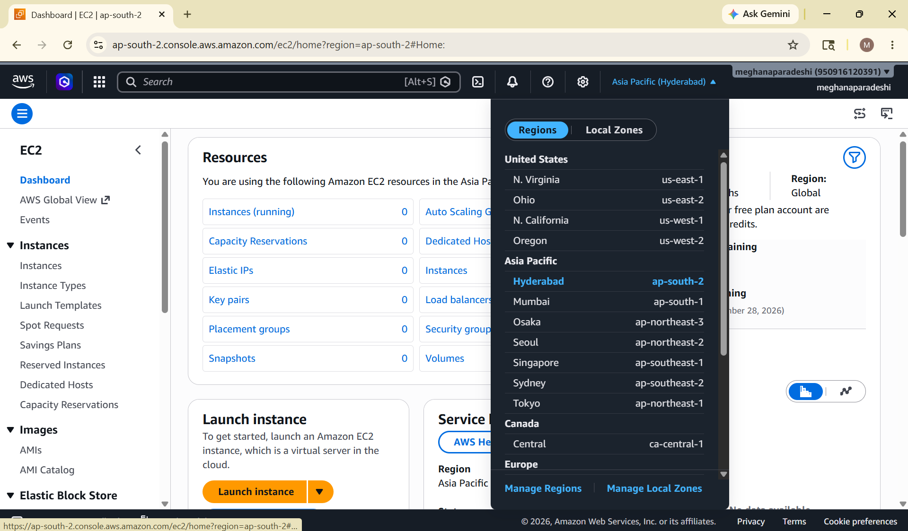

### 2. EC2 Instances Created

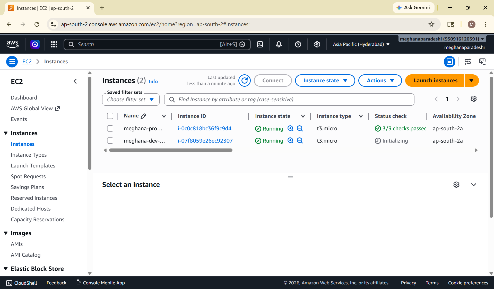

### 3. Account Alias Created

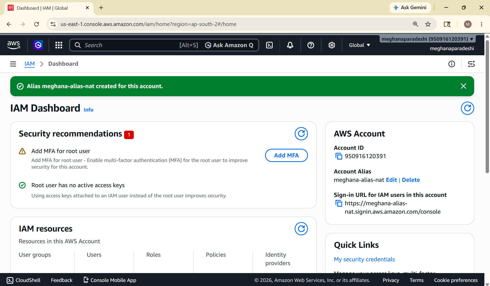

### 4. IAM Policy Created

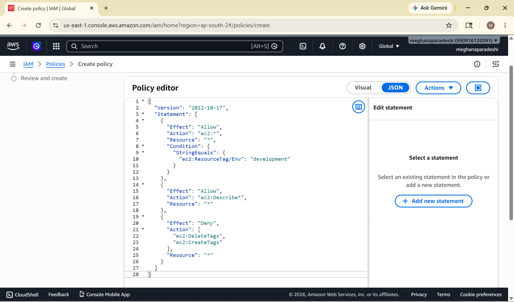


### 5. IAM User Group Created

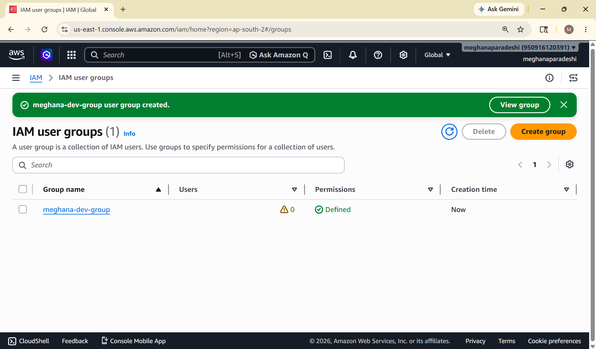

### 6. IAM User Created

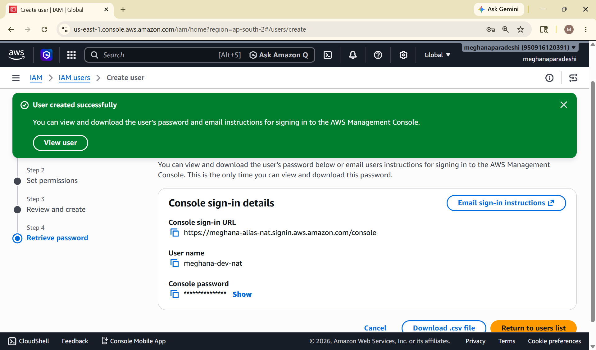

### 7. Login Credentials Downloaded

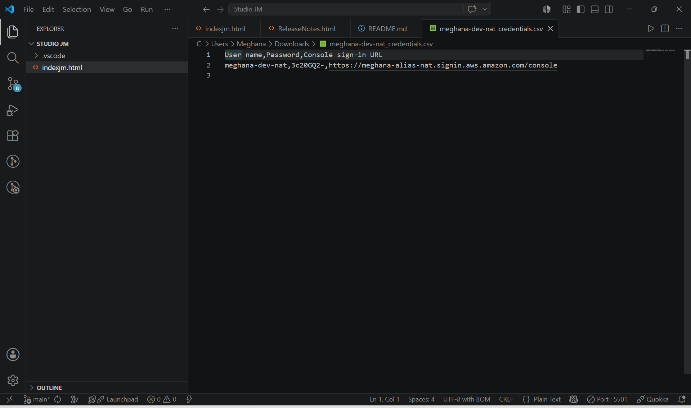

### 8. Console Sign-In URL

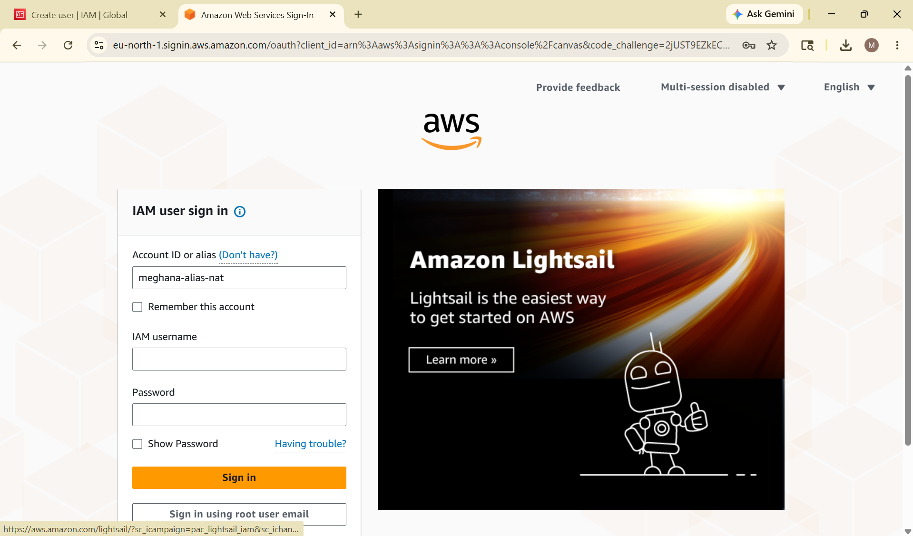

### 9. EC2 Access Denied Error

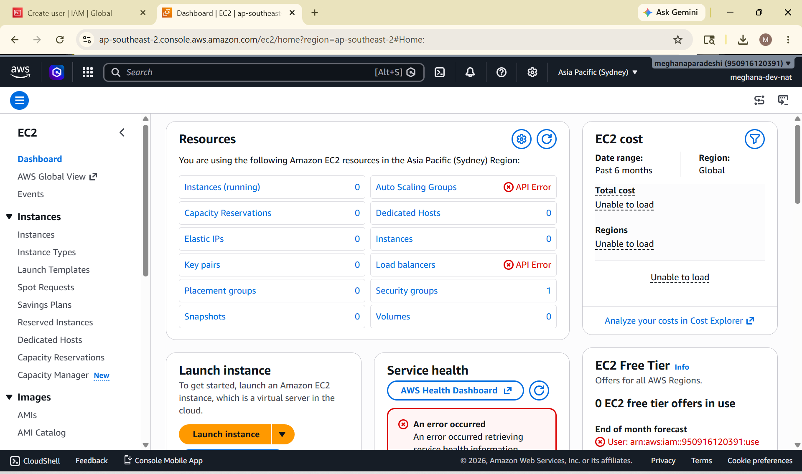

### 10. Development Instance Stopped

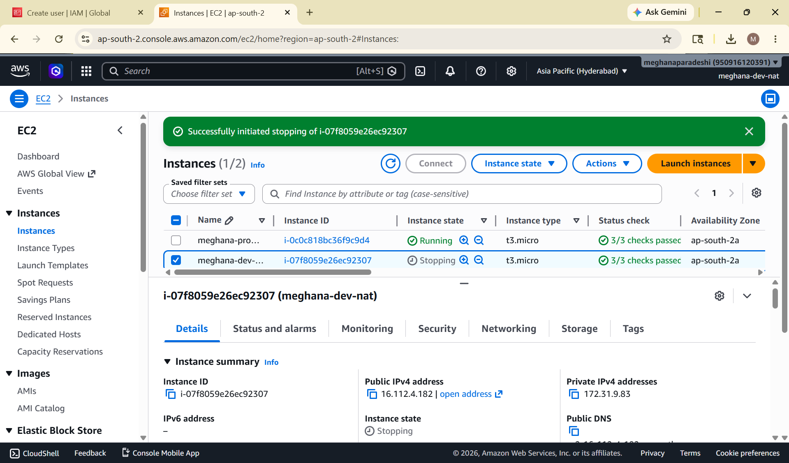

### 11. IAM Policy Simulator


### 12. IAM Policy Statement

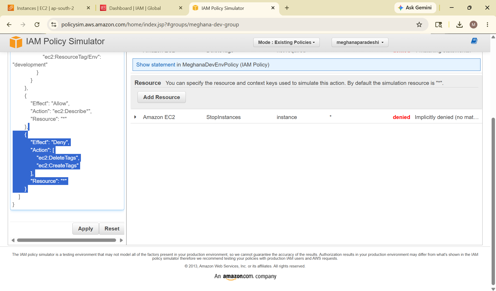

### 13. Resource Tags Added

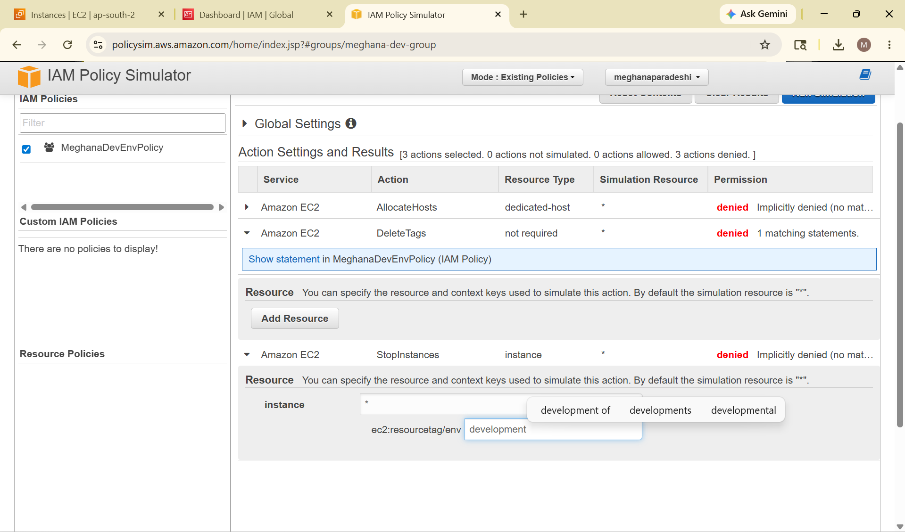

### 14. Permission Allowed

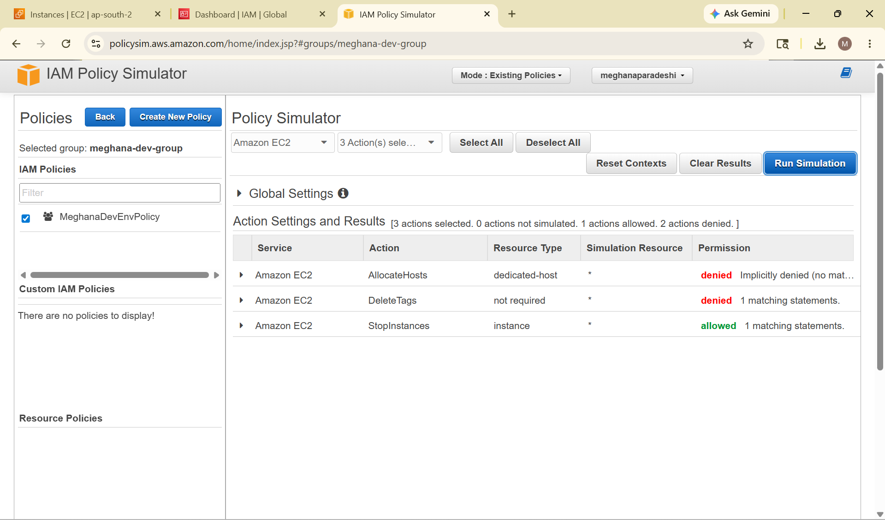

---

## 🐞 Challenge Faced

### Access Denied Error

#### Problem

The IAM user was unable to perform actions on the Development EC2 instance.

#### Root Cause

The required permissions were missing from the IAM policy.

#### Solution

* Opened IAM Policy Simulator
* Tested denied actions
* Identified missing permissions
* Updated IAM Policy
* Retested access successfully

---

## 🔍 What is IAM?

AWS IAM (Identity and Access Management) is a service used to securely control access to AWS resources.

IAM helps define:

* Who can access AWS resources
* What resources they can access
* What actions they can perform

---

## 🎓 Learning Outcomes

* AWS IAM Fundamentals
* IAM Users and Groups
* IAM Policies
* Account Alias Configuration
* Access Management
* Policy Simulator Usage
* Permission Troubleshooting
* Cloud Security Best Practices
* AWS Resource Management

---

## 🔮 Future Enhancements

* Enable MFA for Users
* Implement IAM Roles
* Integrate AWS Organizations
* Configure Cross-Account Access
* Implement Advanced Security Policies

---

## 📝 Note

All AWS resources created during this project were deleted after successful testing to avoid unnecessary AWS charges and follow cloud cost-management best practices.

---

## 👩‍💻 Author

**Meghana Paradeshi**

Aspiring Cloud Engineer

GitHub: https://github.com/meghana1125-ui

---

## ⭐ Support

If you found this project useful, consider giving it a ⭐ on GitHub.
